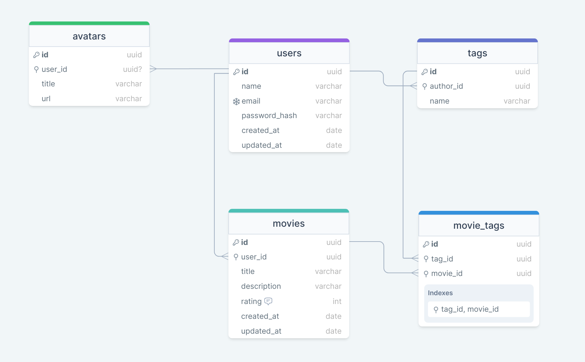

<h1 align="center">Movies</h1>

<p align="center">Explorer | Stage 08 - Movies</p>

<p align="center">
  <a href="#-tecnologias">Tecnologias</a>&nbsp;&nbsp;&nbsp;|&nbsp;&nbsp;&nbsp;
  <a href="#-projeto">Projeto</a>&nbsp;&nbsp;&nbsp;|&nbsp;&nbsp;&nbsp;
  <a href="#-como-executar">Como Executar</a>&nbsp;&nbsp;&nbsp;|&nbsp;&nbsp;&nbsp;
  <a href="#-licença">Licença</a>&nbsp;&nbsp;&nbsp;|&nbsp;&nbsp;&nbsp;
  <a href="#autor">Autor</a>
</p>

<p align="center">
  
</p>

## 🚀 Tecnologias

Esse projeto foi desenvolvido com as seguintes tecnologias:

- [Node.js](https://nodejs.org/en)
- [TypeScript](https://www.typescriptlang.org/)
- [Prisma](https://prisma.io/)
- [Fastify](https://fastify.io/)
- [Docker](https://www.docker.com/)
- [Vitest](https://vitest.dev/)
- [Postgres](https://www.postgresql.org/)
- [JWT](https://jwt.io/)

## 💻 Projeto

A ideia deste exercício foi criar uma aplicação em Node.js onde o usuário cadastra um filme, preenche com algumas informações e cria tags relacionadas a ele.

Veja abaixo o diagrama do banco de dados:

<p align="center">
  
</p>

## 🎲 Como executar

Clone este repositório e acesse o diretório do projeto

Instale as dependências

```bash
npm install
```

Execute o banco de dados

```bash
docker compose up -d
```

Execute as migrations

```bash
npx prisma migrate deploy
```

Faça build do projeto

```bash
npm run build
```

Execute o servidor

```bash
npm run start
```

## 📝 Licença

Esse projeto está sob a licença MIT.

## Autor


<br>

Feito com 💜 por Jordane Chaves
